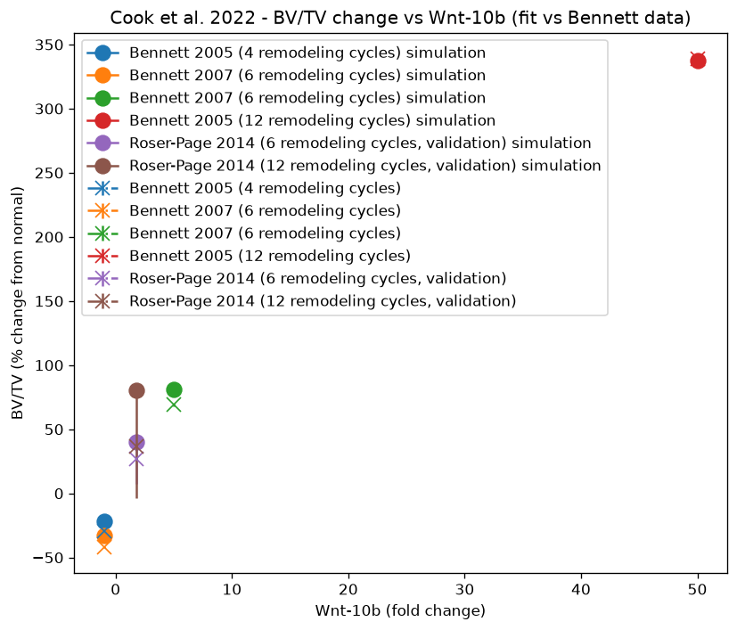
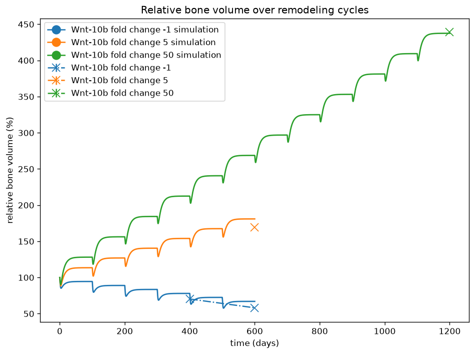
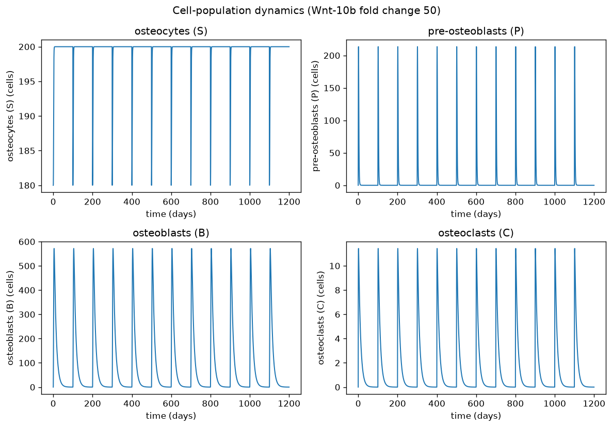
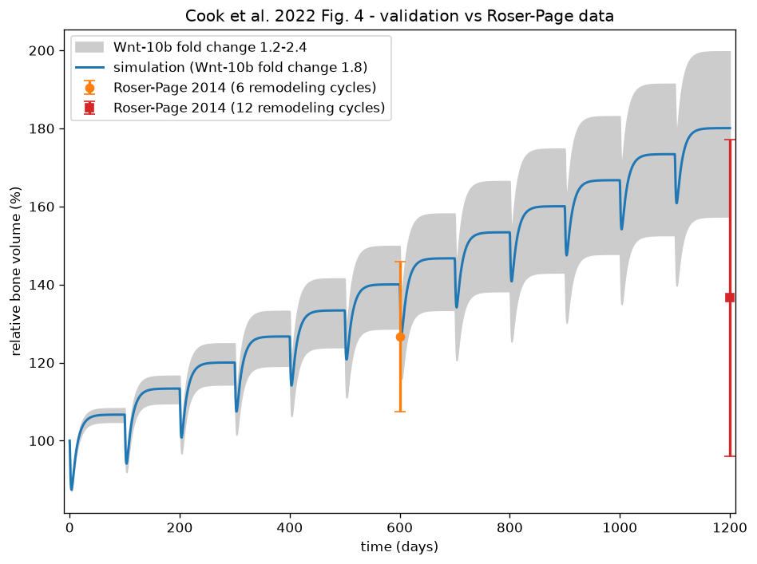
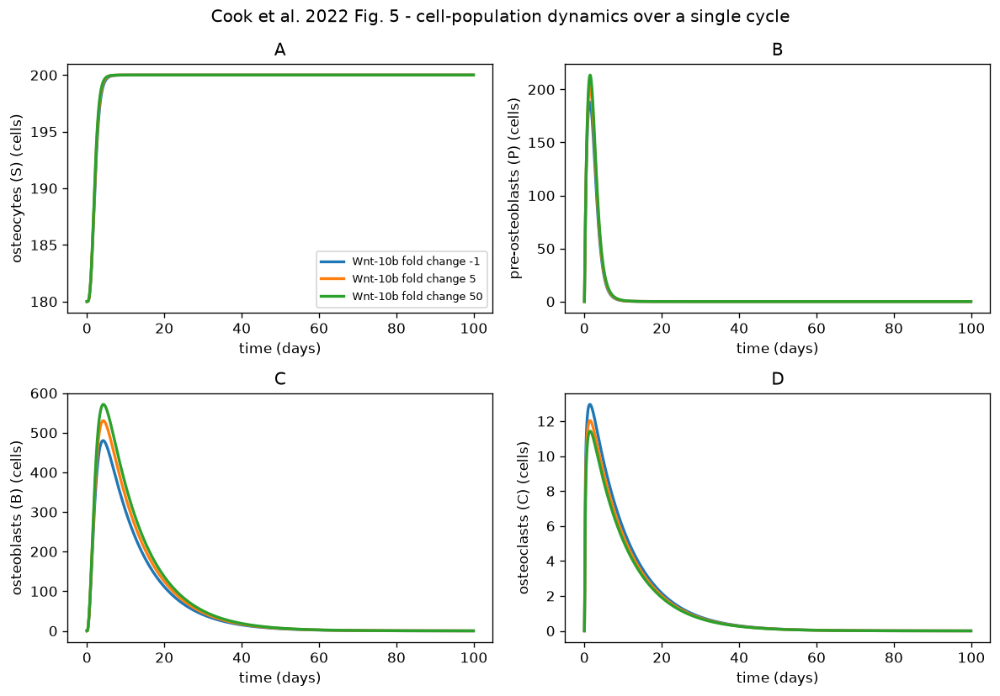
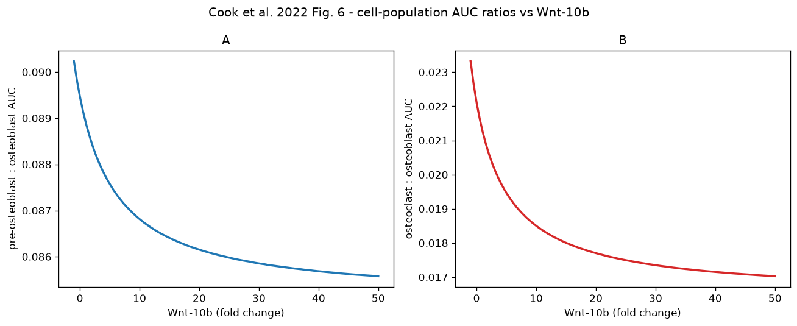

# Cook_AIChE2022

PEtab implementation of the bone-remodeling model of

> C. V. Cook, M. A. Islam, B. J. Smith, A. N. Ford Versypt.
> *Mathematical Modeling of the Effects of Wnt-10b on Bone Metabolism.*
> AIChE Journal, 2022, 68(12), e17809. doi:[10.1002/aic.17809](https://doi.org/10.1002/aic.17809)

Original model, data and MATLAB code: https://github.com/ashleefv/Wnt10bBoneCompartment
Additional background: C. V. Cook, *Mathematical Modeling to Connect Bone
Responses to Systemic Mechanisms* (PhD thesis).

## Model

A compartmental ODE model of a bone multicellular unit over repeated
remodeling cycles. Five species are tracked: osteocytes (`S`),
pre-osteoblasts (`P`), osteoblasts (`B`), osteoclasts (`C`) and relative
bone volume (`z`, in % of the normal value, starting at 100). Wnt-10b enters
the system through a Hill-type factor `piwnta = Wnt / (Wnt + K)` that modulates
pre-osteoblast proliferation, pre-osteoblast-to-osteoblast differentiation and
osteoblast apoptosis.

## Data

Four bone-volume-fraction (BV/TV) measurements compiled in the paper from
Wnt-10b transgenic / knockout mouse experiments (Bennett et al. 2005, 2007),
expressed as percentage change relative to normal Wnt-10b:

| condition | Wnt-10b fold change | remodeling cycles | time [d] | BV/TV change [%] | source |
|-----------|--------------------:|------------------:|---------:|-----------------:|--------|
| `Wnt_m1`  | -1  | 4  | 400  | -29.7 | Bennett 2005 |
| `Wnt_m1`  | -1  | 6  | 600  | -41.9 | Bennett 2007 |
| `Wnt_5`   | 5   | 6  | 600  |  69.2 | Bennett 2007 |
| `Wnt_50`  | 50  | 12 | 1200 | 339.0 | Bennett 2005 |

### Validation data (Roser-Page 2014)

The paper additionally *validates* the fitted model against an independent
dataset that was **not** used for parameter estimation: the CTLA-4Ig
(abatacept) mouse experiments of Roser-Page et al. 2014, which correspond to a
Wnt-10b fold change of ~1.8 (with a 1.2–2.4 range). The two BV/TV endpoints are
reproduced here from the paper's validation figure (`ValidationResults` in the
original `GraphsforPaper.m`):

| condition | Wnt-10b fold change | remodeling cycles | time [d] | BV/TV change [%] | SD  | source |
|-----------|--------------------:|------------------:|---------:|-----------------:|----:|--------|
| `Wnt_1_8` | 1.8 | 6  | 600  | 26.6 | 19.2 | Roser-Page 2014 |
| `Wnt_1_8` | 1.8 | 12 | 1200 | 36.6 | 40.6 | Roser-Page 2014 |

> Reference: S. Roser-Page et al., *CTLA-4Ig-induced T cell anergy promotes
> Wnt-10b production and bone formation in a mouse model*, Arthritis &
> Rheumatology, 2014, 66(4), 990–999. doi:[10.1002/art.38319](https://doi.org/10.1002/art.38319)

These two points are included in the PEtab measurement table (condition
`Wnt_1_8`, dataset ids `RoserPage2014_*`) so the validation figure can be
reproduced. Unlike the Bennett fitting data (fixed unit noise), the validation
points carry their **reported standard deviations** (19.2, 40.6) as
`noiseParameters`. Because these SDs are large relative to the unit-noise
Bennett residuals, the validation points contribute negligibly to the objective
and the fit (see below) is still effectively determined by the Bennett data
alone, matching the original study where Roser-Page was held out for
validation.

## PEtab problem

* **Conditions** (`experimentalCondition`): the three Wnt-10b fold changes used
  for fitting (-1, 5, 50) plus the validation fold change (1.8, `Wnt_1_8`).
* **Observable** (`observables`): `obs_BV = Bone_volume__z - 100`, the relative
  BV/TV change. The paper fits with unweighted least squares; this is
  reproduced with a fixed unit noise (`normal`), so the objective equals the
  residual sum of squares up to a constant.
* **Estimated parameters** (`parameters`): the four Wnt-10b-related parameters
  `beta1adj`, `alpha3adj`, `beta2adj`, `K`.
* **Visualization**: BV/TV change vs Wnt-10b fold change (dose-response).

### Multiple remodeling cycles as SBML events

The number of remodeling cycles is the key feature of the original model, and
the SBML export shipped with the paper explicitly *does not* support it. In the
MATLAB code each 100-day cycle is integrated separately and the state is reset
at the cycle boundary: cell populations that have decayed below 1 are set to 0
and the osteocyte count is reduced by 20 to initiate the next cycle.

Here this is encoded as **11 time-triggered SBML events** at
`t = 100, 200, ..., 1100` (supporting up to 12 cycles), each performing that
reset. Crucially, bone volume `z` is **not** reset, so it is continuous across
cycle boundaries and the `z`-based observable is unambiguous at the measurement
times even when they coincide with a cycle boundary. A single trajectory per
Wnt-10b dose therefore reproduces all cycle counts: the measurement is simply
read at `t = cycles x 100`.

## Nominal parameters

Taken from the publication's final fit (the parameter set used to generate the
paper figures in `GraphsforPaper.m`, "after the 4th data point was added"):

| parameter | nominal | note |
|-----------|--------:|------|
| `beta1adj`  | 0.177617716487146    | `= k1` |
| `alpha3adj` | 0.260931032760533    | `= k1 + k2` |
| `beta2adj`  | 0.000709650034656732 | `= k3` |
| `K`         | 6.26349707992014     | `= k4` |

## Differences from the original publication

* **Reparameterization.** The MATLAB code estimates `k1..k4` with
  `alpha3adj = k1 + k2`. Here `beta1adj, alpha3adj, beta2adj, K` are estimated
  directly (they are already SBML parameters); this is an equivalent
  parameterization of the same 4-parameter space.
* **Multiple cycles via events** (see above) rather than sequential
  re-initialized integrations.
* The `parameters` values in the shipped SBML export are corrected: its
  `beta1adj = 0.0833` is in fact the value of `k2`; the nominal values here use
  the published `k1..k4`.
* The reaction kinetics match the shipped SBML export, which omits the
  `max(1 - S/K_S, 0)` clamp present in the MATLAB code; the two agree because
  `S < K_S` throughout the simulated trajectories.

## Fitting notes

The nominal fit was obtained in the original study with MATLAB `lsqcurvefit`
(Levenberg-Marquardt) from Latin-hypercube / normally-distributed multistarts.
It is a least-squares compromise across the four data points rather than an
exact interpolation (residual sum of squares ~278 in BV/TV-% units). The
`Wnt_50 / 12-cycle` point is reproduced almost exactly.

## Reproducing the figures

`make_figures.py` simulates the model (libroadrunner) and plots with
`petab.v1.visualize`:

```bash
python make_figures.py   # requires petab, libroadrunner, matplotlib, numpy, pandas
```

### Figure 1 — dose-response validation
Model fit (filled circles) vs Bennett 2005/2007 data (crosses).



### Figure 2 — relative bone volume over remodeling cycles
The sawtooth trajectory (resorption dip then formation rebound each cycle) for
Wnt-10b fold changes -1, 5 and 50, with the literature endpoints overlaid.



### Figure 3 — cell-population dynamics (Wnt-10b fold change 50)
Osteocyte, pre-osteoblast, osteoblast and osteoclast counts across the 12 cycles.



The following three figures use the **numbering of the original publication**.

### Figure 4 — model validation against Roser-Page 2014 data
Relative bone volume over 12 remodeling cycles at a Wnt-10b fold change of 1.8,
with the 1.2–2.4 fold-change envelope shaded, compared with the two independent
Roser-Page BV/TV endpoints (held out from the fit). Both data points lie on the
simulated trajectory.



### Figure 5 — activated cell-population dynamics over a single remodeling cycle
Osteocyte, pre-osteoblast, osteoblast and osteoclast time courses for Wnt-10b
fold changes -1, 5 and 50: (A) osteocytes change little with Wnt-10b, (B)
pre-osteoblasts increase slightly, (C) osteoblasts increase, and (D) osteoclasts
decrease with increasing Wnt-10b. Populations settle well before the 100-day
cycle boundary.



### Figure 6 — cell-population AUC ratios vs Wnt-10b
Pre-osteoblast:osteoblast (A) and osteoclast:osteoblast (B) area-under-curve
ratios over a single remodeling cycle as a function of the Wnt-10b fold change;
both ratios decrease with increasing Wnt-10b.


